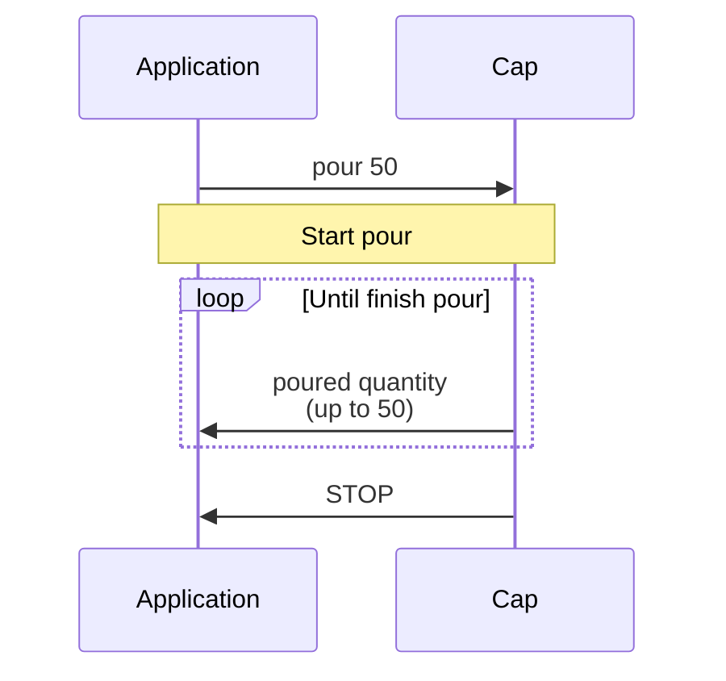

# FitFlow app

## Use cases

## Navigation

## Interactions

```mermaid
sequenceDiagram
    participant A as Application
    participant B as Cap
    A ->> B: pour 50
    Note over A,B: Start pour
    loop Until finish pour
        B ->> A: poured quantity<br> (up to 50)
    end
    B ->> A: STOP

```